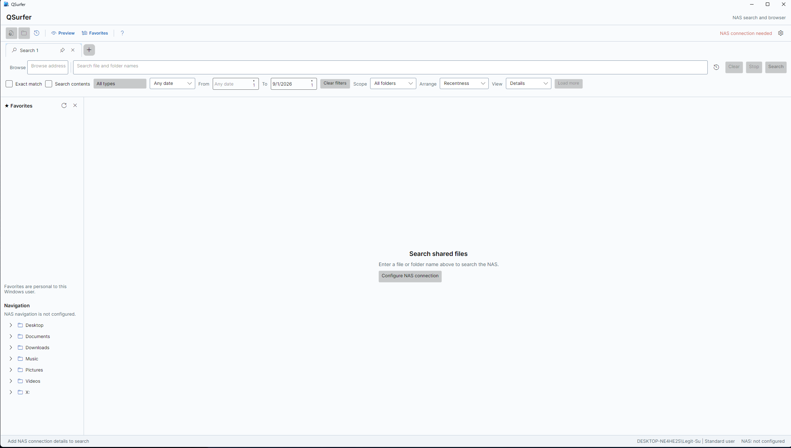
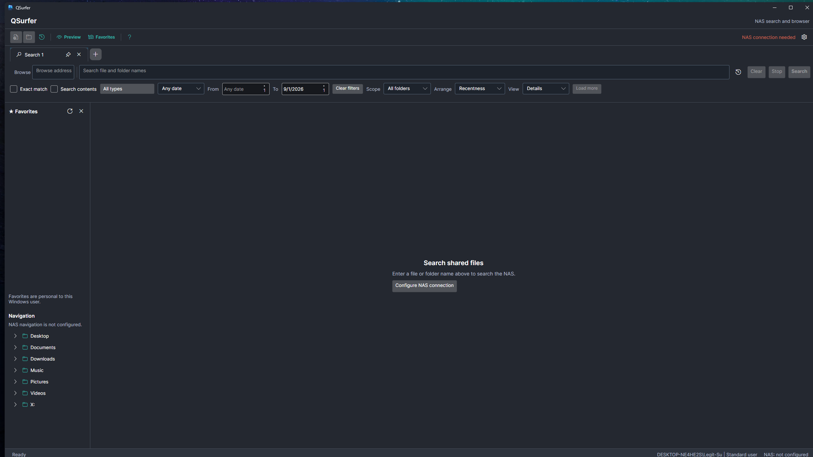

# QSurfer

QSurfer is an Explorer-style desktop search and browser for indexed shared
storage. It can query Qsirch, QIndexer, or both at once; opening and browsing
always use the user's ordinary file-system permissions.

## What It Does

- Search files and folders with exact-match, content, type, date, scope, and view controls
- Search through Qsirch, QIndexer, or both configured providers and keep using a healthy provider when the other is unavailable
- Include and exclude multiple folder branches per search tab, then save that scope with a recurring search
- Use browser-style search and folder tabs without losing an active search
- Browse NAS shares and local folders with back, forward, up, address, and folder-tree navigation
- Open, show, copy, rename, delete, favorite, group, and inspect files using familiar Windows behavior
- Display installed preview handlers for supported files on Windows and use native image, PDF, and office conversion support on Linux
- Keep favorites, groups, saved searches, and recent searches private to each user
- Support light, dark, and Follow system themes, taskbar/tray behavior, configurable shortcuts, Windows mapped drives, and Linux SMB mounts

## Screenshots

### Ready to connect





## User Guide

The in-app Help button includes a workflow-oriented reference. The same guide is
available in [docs/User-guide.md](docs/User-guide.md).

## Build

Requirements: .NET SDK 9 or later on Windows.

```powershell
dotnet build QSurfer.slnx -c Release
```

Run the development app with:

```powershell
dotnet run --project src/QSurfer.Avalonia/QSurfer.Avalonia.csproj
```

Run automated regression checks with:

```powershell
.\test-qsurfer.ps1 -Build
```

With the NAS and VPN connected, run the opt-in live smoke check with:

```powershell
.\test-qsurfer-live.ps1 -Query legal
```

It loads this workstation's existing QSurfer connection, authenticates, and
runs a five-result name search. It never mounts, browses, creates, changes,
restores, or deletes NAS content. This check is deliberately excluded from
the normal test script and CI.

GitHub Actions runs the same regression suite and a compile check on Windows
and Linux for every pull request and push to `main`. The suite includes
headless Avalonia layout checks for the main workspace at normal and compact
window sizes, including independent Favorites, Navigation, and Preview panes,
responsive filter reflow, and tab-state transfer between windows.

`build-qsurfer.bat` recreates a portable Windows package in `dist/QSurfer`.
It includes only a blank `config/config.json` template; configure the NAS
connection through Settings after first launch. Never commit a working config,
session, database, or log.

## Project Layout

- `src/QSurfer.Core`: Qsirch and QIndexer clients, settings, rules, history, path resolution, and browsing services
- `src/QSurfer.Avalonia`: Avalonia desktop application and platform integrations
- `docs`: product contract and migration/parity checklist

## Attribution

QSurfer builds on the Qsirch REST API work from
[iios-co/qsirch](https://github.com/iios-co/qsirch). See [NOTICE](NOTICE)
and [LICENSE](LICENSE).

The Avalonia explorer experience was designed with
[JANECEA/FileSurfer](https://github.com/JANECEA/FileSurfer) as a reference.
No FileSurfer source code or assets are included in this repository.
